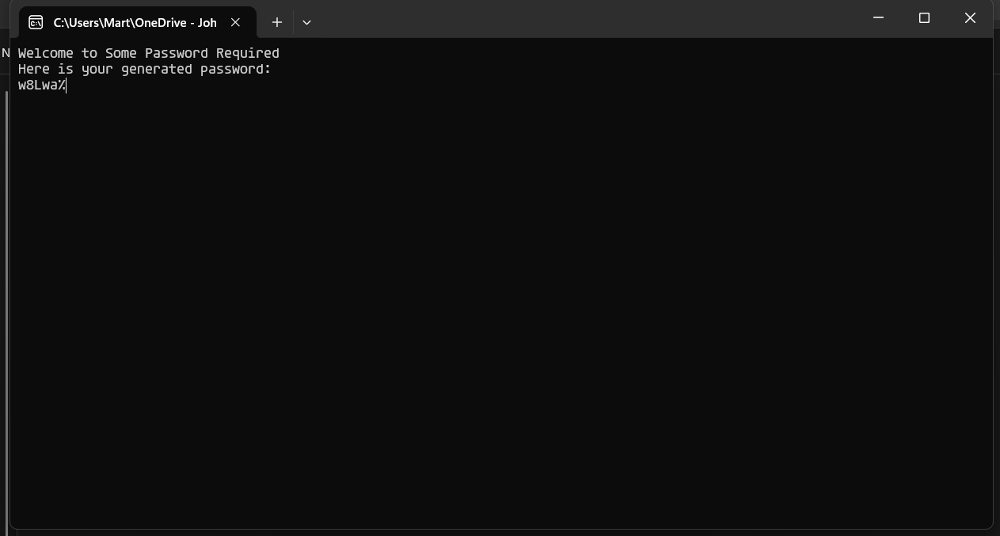

# Some Password Required
My first attempt of writing an Assembly program (without really properly understanding my computer yet... but I'm working on it!)
It's a very simple password generator written in 100% pure X86 assembly. The only thing used except for assembly are batch and shell files to simplify running the program for Windows and UNIX-like systems accordingly.

Credits: [Some Assembly Required](https://github.com/hackclub/some-assembly-required) by Hack Club to help me get going and inspire me to build a project :)

By the way, try playing around with the character length, It'll change automatically! Later the app will support entering it via console as well.

# How do I run it?
Currently I only support Windows because I can test that the easiest and have some experience with developing for Windows and Windows Assembly also uses C functions instead of stuff like syscalls and interrupts.

But if you're on Windows, congrats my friend! It's actually really easy to get going, I'll show you.

**Prerequisites:** We'll need GNU GCC in order to convert our output file into an executable. There are many ways to install GCC for Windows, but personally I think this is the easiest:
1. Go [here](https://winlibs.com/), scroll down to "Release versions" and click on Win64 (I assume you have a 64-bit machine, but my program won't work on 32-bit machines anyways)
2. Unzip it and put it in a nice directory. I always prefer "C:/Users/username/Documents/Apps" but might as well just put it in "C:/" or on your desktop.
3. Add it to PATH and then test it out. You can try `gcc --version` to see if it worked.

We'll also need NASM, but when you run the Batch script it'll automatically be installed. If you prefer doing it yourself, you can as well do that. The Batch script will check if you have it installed or not, and if it's wrong you can always say "No" to it.

## Running!
The only thing you need to do is download the contents of this repository in a way how you like (click on the big green Code button in the upper right corner of the repository menu and choose what you like) and then run the batch script. Enjoy!!

# Pictures and videos

https://github.com/user-attachments/assets/71c2d868-c078-451a-9811-89f17cbad275

# Remarks
You may ask, why does this executable take so long to close down? Honestly I don't really know what the issue is, but at least if you open it without using the terminal but just click on the executable, you have some time to jot down or copy your newly generated password!
